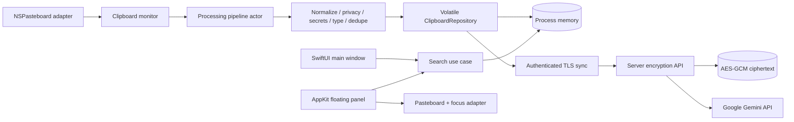

# Architecture overview

## Components

`AIClipboardCore` contains domain types, protocols, use cases, and infrastructure that does not depend on UI. `AIClipboardApp` owns all macOS interaction and presentation. The repository and pipeline are actors so mutable database/pipeline state is serialized while UI calls stay asynchronous.

## Module boundaries

| Boundary | Owns | Must not own |
|---|---|---|
| Domain | item/search types and protocols | AppKit, SQLite handles, views |
| Application | pipeline ordering, canonical deduplication, privacy decisions | windows, pasteboard polling |
| Infrastructure | process memory, TLS transport, server encryption | SwiftUI state |
| System integration | pasteboard, Carbon hotkey, Login Items, encrypted sync transport | ranking or persistence rules |
| Presentation | navigation, quick search, onboarding, settings | SQL or content classification |

## Reliability

The capture path starts even before server configuration and inserts one
canonical logical item into process memory. When configured, it uploads through
authenticated TLS and the server encrypts it before database insertion. If the
server is unavailable the item remains available only until the process exits;
clipboard payloads never fall back to disk. Each connected launch reconstructs
memory from the server event stream.

## Cross-platform path

Windows support replaces `ClipboardMonitor`, `GlobalHotKey`, `PasteController`, and the SwiftUI presentation shell. The server history API, domain behavior, and model endpoint stay shared; clients own no encryption key.
