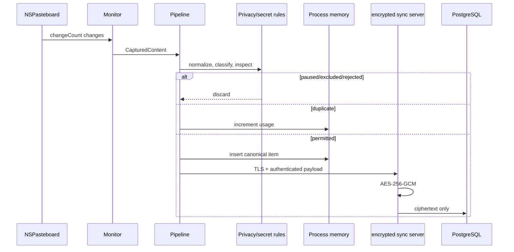
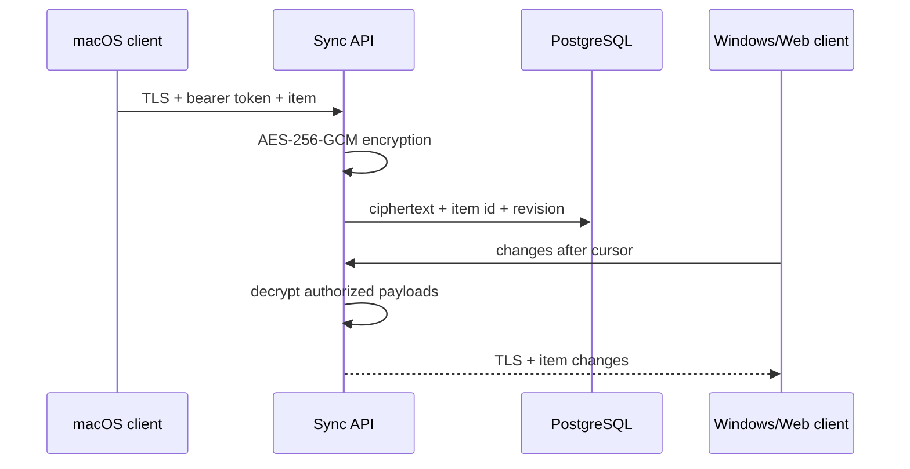

# Data flow

## Capture and server persistence

Stage failures never log content. Unsupported or oversized payloads stop at the boundary. Clipboard payloads and image bytes are never written to local storage.

## Retrieval and paste

The AI request contains only the query and selected RU/EN locale. The server
decrypts its own history, excludes protected items, selects candidates, and
sends those bounded snippets to Google Gemini using a backend-only API key. It
returns a localized answer plus allowlisted item IDs. The Mac has no API key,
local AI model, or persisted index.

## Encrypted device sync

There is no client recovery key. The server owns `SERVER_DATA_KEY`, can decrypt
authorized history for synchronization and AI, and must therefore run inside a
trusted, audited environment. Database rows and backups contain AES-GCM
ciphertext rather than clipboard plaintext.
